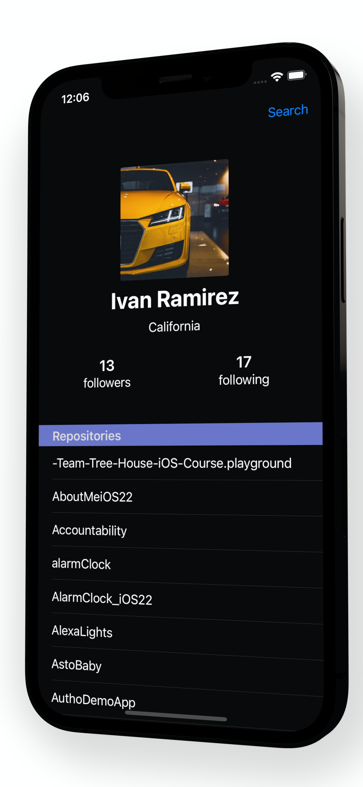

# GitHub Finder
> An iOS app to easily search GitHub users and explore their repositories. Get user details and repository commit insights on the go.

[![Swift Version][swift-image]][swift-url]



## Features

- [x] URLSession 
- [x] User Defaults
- [x] Storyboards
- [x] Dynamic Dark Mode


## Requirements

- iOS 14.5+
- Xcode 12.5

## Installation 

#### Xcode 
You will need [Xcode](https://apps.apple.com/us/app/xcode/id497799835?mt=12) to open and run the app 

#### Internet Connection 
This app relies on a stable internet connection to obtain a user's GitHub details 

## Model Code Snippet 
Utilizing coding keys and Decodable to obtain and read GitHub's API JSON data properly 
```swift

struct Repo: Decodable {
    let name: String
    let owner: Owner
}

struct Owner: Decodable {
    let avatarURL: URL?
    let login: String
    
    enum CodingKeys: String, CodingKey {
        case avatarURL = "avatar_url"
        case login 
    }
}
}
```
## URLSessions Code Snippet 
Leveraging the Result type allows for improved handling of success and faliure calls
```swift 

func fetchRepos(for user: String, completion: @escaping (Result<[Repo], NetworkingError>) -> Void) {
......
}
```


## API Call Code Snippet
Error handling included notifying the user of an issue with their request 
```swift 

private let networkManager = NetworkManager()

func fetchRepos(name: String) {
    networkManager.fetchRepos(for: name) { [weak self]   result in
        switch(result) {
        case .failure(let error):
            DispatchQueue.main.async {
                let error =   AlertManager.presentAlertControllerWith(alertTitle: "", alertMessage: error.rawValue, dismissActionTitle: "OK")
                self?.present(error, animated: true, completion: nil)
            }
            return
        case .success(let repos):
            self?.repos = repos
            DispatchQueue.main.async {
                self?.tableView.reloadData()
            }
        }
    }
}
```

## Let me know what you think

Ivan Ramirez 
[@IvansTwitter](https://twitter.com/iramirezdev) 
LinkedIn [LinkedIn](https://www.linkedin.com/in/ivanframirez/) 

[swift-image]:https://img.shields.io/badge/swift-5.0-orange.svg
[swift-url]: https://swift.org/
